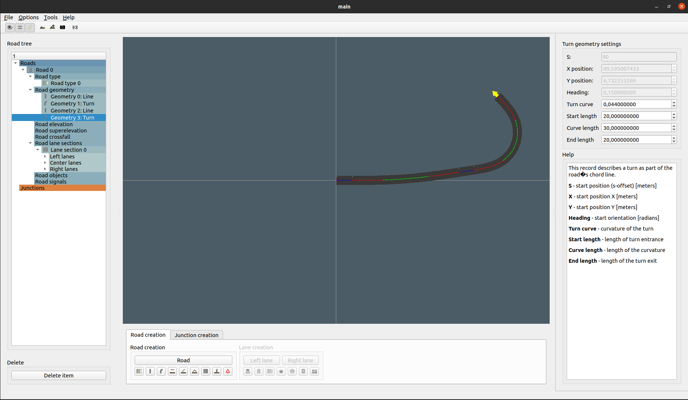

# OpenRoadEd on Linux

OpenRoadEd is simple application designed to create both logical (OpenDRIVE standard) and geometrical (OpenSceneGraph) descriptions of road networks created by Dmitri and Egor Kurteanu as a Windows application (see below). This fork was adapted to compile on modem linux operating systems by Hermann Höhne and Hamid Ebadi.




## Build Instructions (tested on Ubuntu 20.04)

### Install dependencies

```
sudo apt install git cmake g++ libopenscenegraph-dev qt5-default
```

### Build osgQt

```
cd ~
git clone https://github.com/Gepetto/osgQt.git
cd osgQt/
git checkout 6e4de
mkdir build ; cd build ; cmake .. ; make
sudo make install
```

### Build OpenRoadEd

```
cd ~
git clone https://github.com/ebadi/OpenRoadEd.git
cd OpenRoadEd/OpenRoadEd
mkdir build ; cd build ; cmake .. ; make
cp OpenRoadEd/OpenRoadEd/build/main ~/OpenRoadEd/OpenRoadEditor
```

### Run OpenRoadEd

Execute OpenRoadEd binary from the same directory as "Resources" dicrectory by running the following commands

```
cd ~/OpenRoadEd/
./OpenRoadEditor
```

#### Known issues

- Loading and rendring open drive (.xodr) files. Until a patch is made available you can use [esmini](https://github.com/esmini/esmini) to view the resulting files.

### Windows application
OpenRoadEd was created as part of this [master's thesis by Dmitri and Egor Kurteanu](http://hdl.handle.net/2077/23047) that is accessible from [sourceforge](https://sourceforge.net/projects/openroaded/) and [gitlab](https://gitlab.com/OpenRoadEd/OpenRoadEd).


